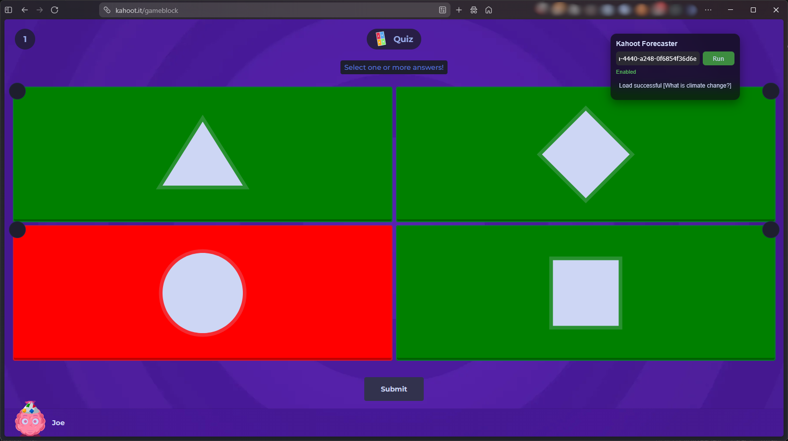
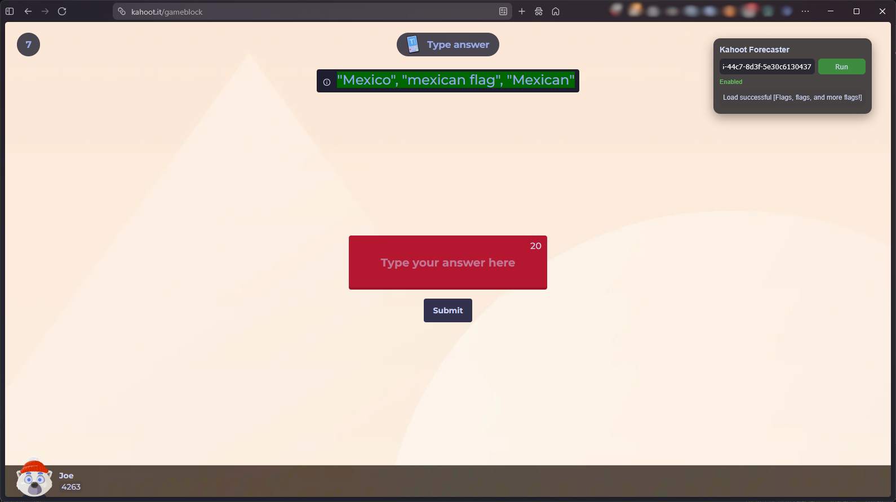
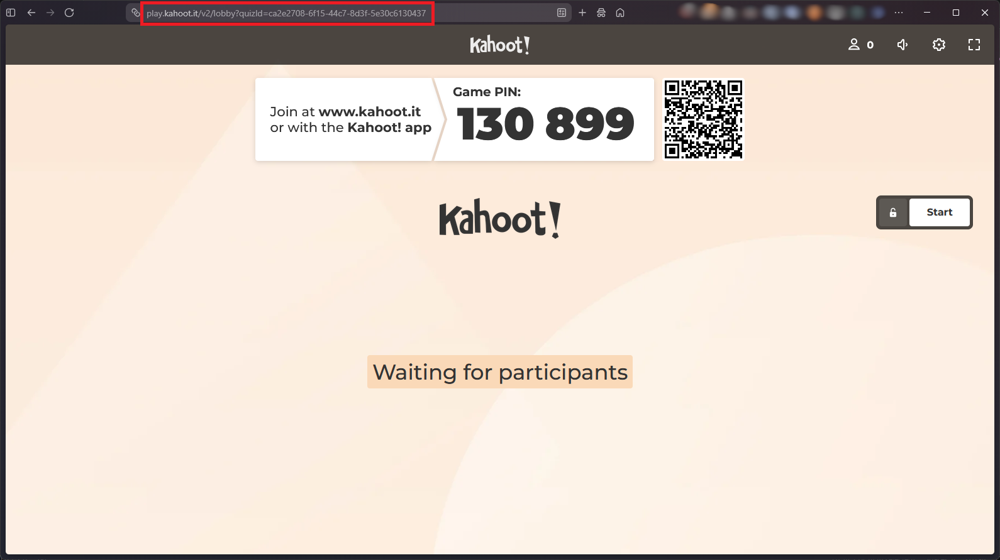

# Kahoot Forecaster

A userscript which loads the quiz questions data and for each question colors the right answer as green. Answers are fetched from Kahoot's REST API by the quiz ID.

# Features

Currently supports 6 (probably the most common) quiz types:
- Standard
- Multiple choice
- True / false
- Type answer
- Jumble
- Poll

Each correct answer is marked in green, others are red.  
Works even if started during the quiz or if the page got reloaded.

# Requirements

- [Tamper Monkey](https://www.tampermonkey.net/) or any compatible userscript manager (Violentmonkey, Greasemonkey)
- Suggest [Google Lens](https://lens.google/intl/cs/) (or similar) to scan and copy the quiz host URL

# Installation

1. Install [Tamper Monkey](https://www.tampermonkey.net/) browser extension
2. Create a new script
3. Paste the [script](kahoot_forecaster.js) inside and save

# Usage

1. Go to [Kahoot!](https://kahoot.it/) and join a game.
2. You have to scan/copy the web URL (or quiz ID) of the quiz host.
3. Paste the value into the script input box and press Run.
4. If the link is correct and the data has been fetched successfully, the status message will chage to green `enabled`.
5. Now the script is prepared and running.

# Permissions

The following special permission is required:
- `GM_xmlhttpRequest` - API for less restricted network requests